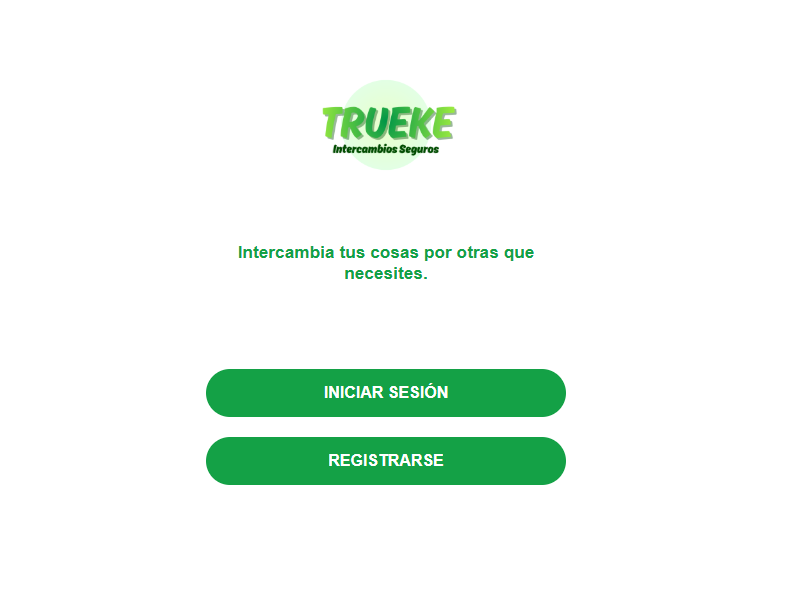
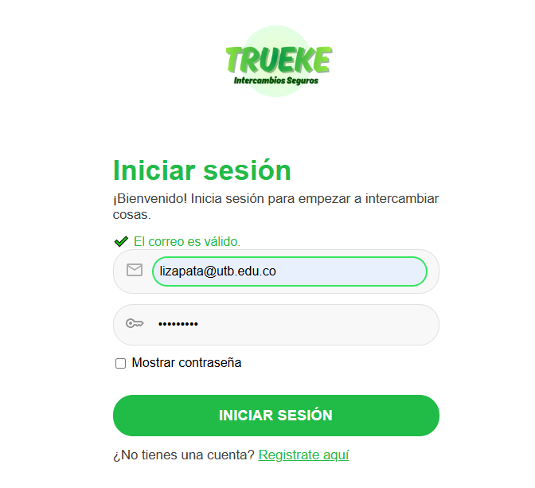
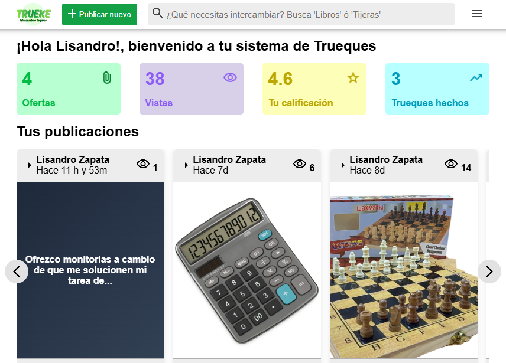
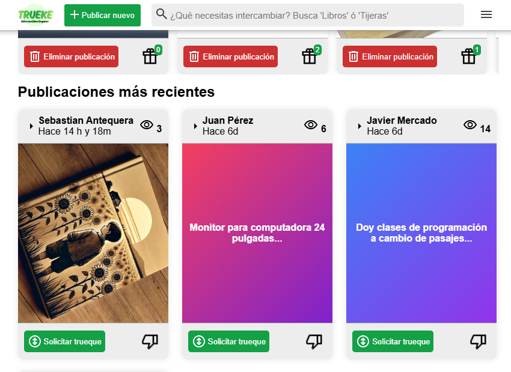
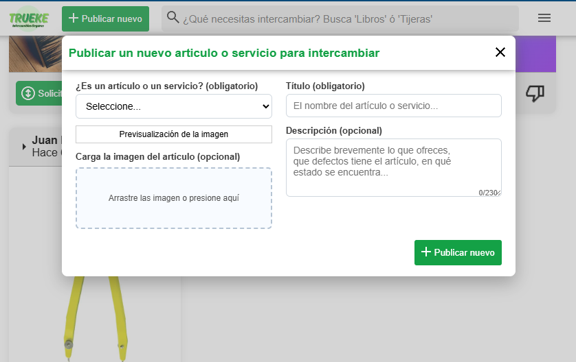
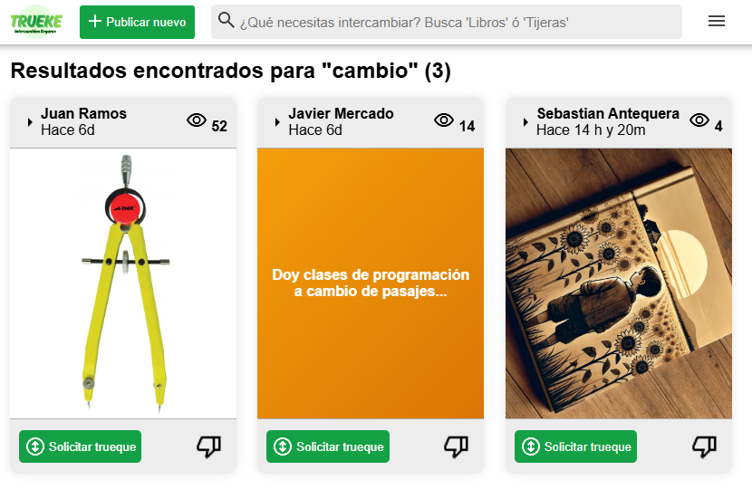
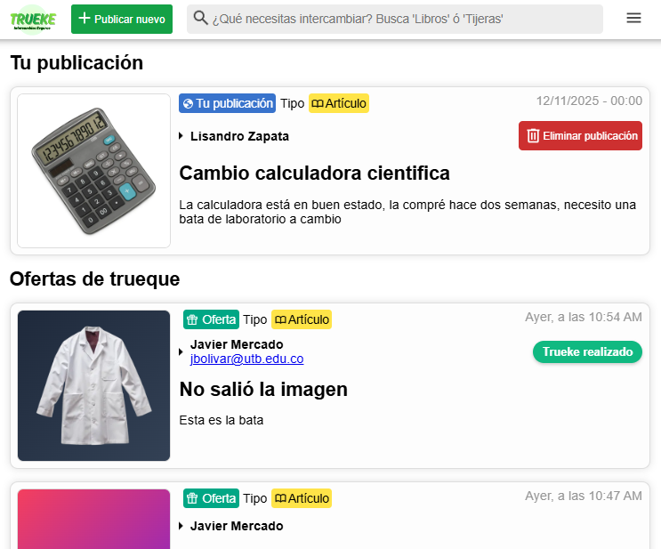

# Sistema de Trueques TRUEKE

TRUEKE es una plataforma web institucional que permite a los usuarios realizar intercambios de artículos/servicios mediante publicaciones y ofertas, facilitando la gestión completa del proceso de trueque.

## FUNCIONALIDADES PRINCIPALES

- Registro y autenticación de usuarios.
- Estadísticas personalizadas, incluyendo:

1. Número de ofertas recibidas.
2. Número de visualizaciones.
3. Calificación del usuario.
4. Número de trueques completados.

- Creación y administración de publicaciones.
- Recepción y gestión de ofertas sobre una publicación.
- Eliminación de publicaciones creadas por el usuario.
- Búsqueda de publicaciones mediante palabras clave.
- Gestión del estado del trueque: aceptado, cancelado y finalizado (cuando se concreta el intercambio).
- Sistema básico de feed para visualizar publicaciones recientes.

## ARQUITECTURA DEL SISTEMA

- Frontend: HTML, CSS y JS Vanilla.
- Backend: PHP + MySQL.
- Patrón: Cliente-Servidor con MVC.
- Estructura de las carpetas.

```
trueke/
├── assets/                       # Recursos estáticos globales
│   ├── css/                      # Hojas de estilo
│   ├── icons/                    # Iconos e imágenes pequeñas
│   ├── samples/                  # Imágenes usadas en las publicaciones
│   └── screenshots/              # Capturas de pantalla del sistema
│
├── front/                        # Interfaz del usuario (frontend)
│   ├── views/                    # Vistas principales del sistema
│   │   └── js/                   # Scripts asociados a las vistas
│   └── (archivos front adicionales)
│
├── back/                         # Lógica del servidor (backend)
│   ├── api/                      # Endpoints PHP que atienden solicitudes
│   └── database/                 # Base de datos y scripts SQL
│       ├── preliminary_database.sql
│       └── inserts.sql
│
└── (archivos del proyecto)
```

## REQUISITOS PREVIOS

1. XAMPP (o un servidor Apache + MySQL equivalente).
2. Extensión GD habilitada en php.ini.
   - Ubica la línea ";extension=gd"
   - Elimina el punto y coma `;` inicial.
   - Reinicia Apache para aplicar los cambios.

## INSTALACIÓN

1. Crear una base de datos vacía con el nombre `trueke` o en su defecto el nombre definido en `/trueke/back/connection.php` en la variable $database_name.

2. Importar el modelo de base de datos en la consola SQL:
   `/trueke/back/database/preliminary_database.sql`

3. (Opcional) Importar los inserts:
   `/trueke/back/database/inserts.sql`
   Las contraseñas por defecto de esos usuarios son "123456789" y se cifran automáticamente.

4. Clonar el repositorio: 
`git clone https://github.com/LisoProgrammer/trueke.git` ó extraer el ZIP en la carpeta pública del servidor.

5. Acceder desde el navegador a:
   `http://localhost/trueke/front`

6. (Opcional) Modificar parámetros de conexión a base de datos en `/trueke/back/connection.php`.

7. El sistema estará listo para usarse.

## Licencia

Licencia: `MIT License`

## Screenshots









